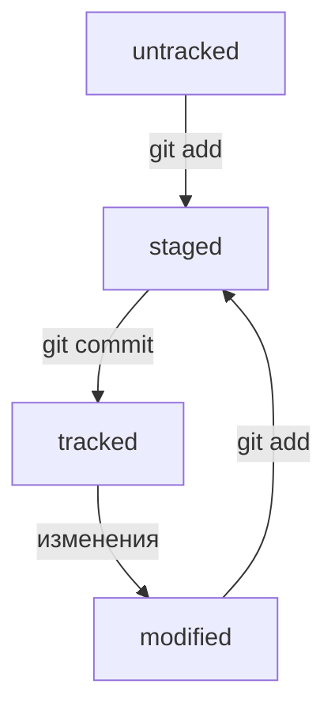

# Краткая инфа по Git
###
[Вводные команды по работе с Git](https://habr.com/ru/companies/ruvds/articles/599929/)  
[Ознакомиться с более подробным руководством](https://git-scm.com/book/ru/v2/Введение-О-системе-контроля-версий)

## статусы файлов

